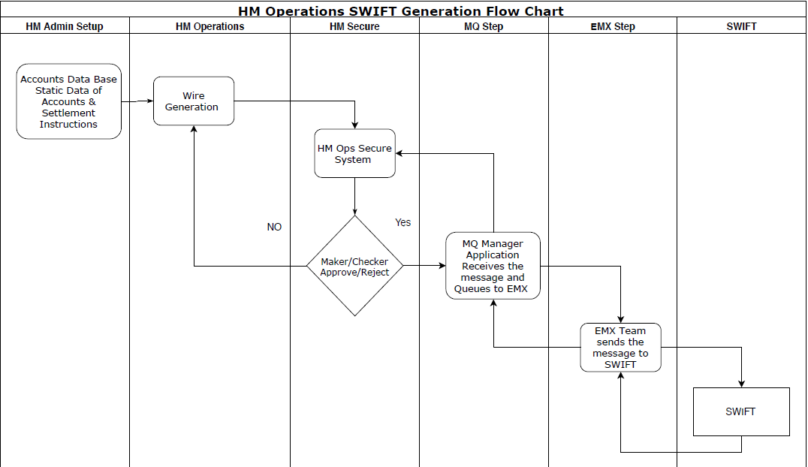

# HedgeMark Operations Secure

The project is created to approve and manage wire tickets generated from HM-Operations site

## Project Description

Project is build with .Net framework in C#. The project is integerated with Swift framework through EMX team. more documentation can be found in [DMOOPS-1](https://jira15.bnymellon.net/browse/DMOOPS-1)

